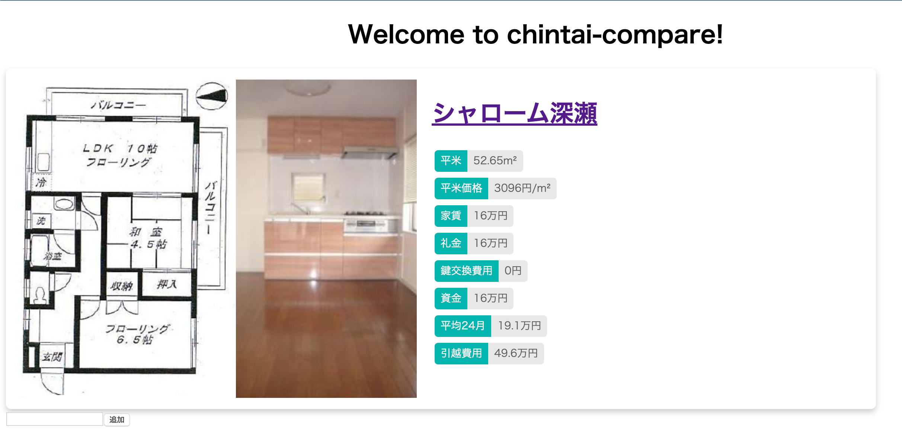

# ChintaiCompare

This project was started after looking for an apartment in Japan and realizing there are some data that can be easily calculated, such as, over 2 years, including the initial costs, one flat could turn out cheaper than another flat.

Also, the price per square meter is an interesting factor.

I only got as far as to display some data and do some of the calculations though. Ideas for completion involved:

- Parsing urls from Suumo and LifullHomes
- Automatically pulling down pictures and having a good slide library
- Sharing comparisons between multiple people
- Exporting the data to google sheets
- Grading the apartments
- Automatically calculating commute distance to a given point

## Development server

Run `ng serve` for a dev server. Navigate to `http://localhost:4200/`. The app will automatically reload if you change any of the source files.

## Running unit tests

Run `ng test` to execute the unit tests via [Karma](https://karma-runner.github.io).
